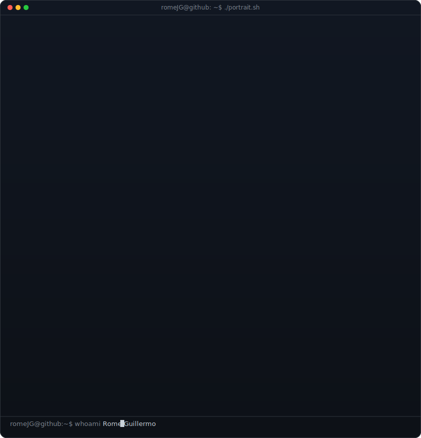
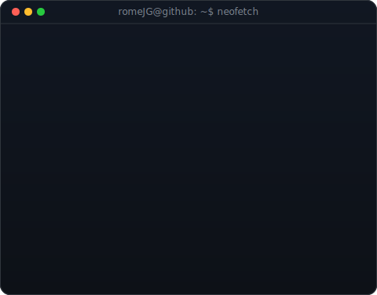
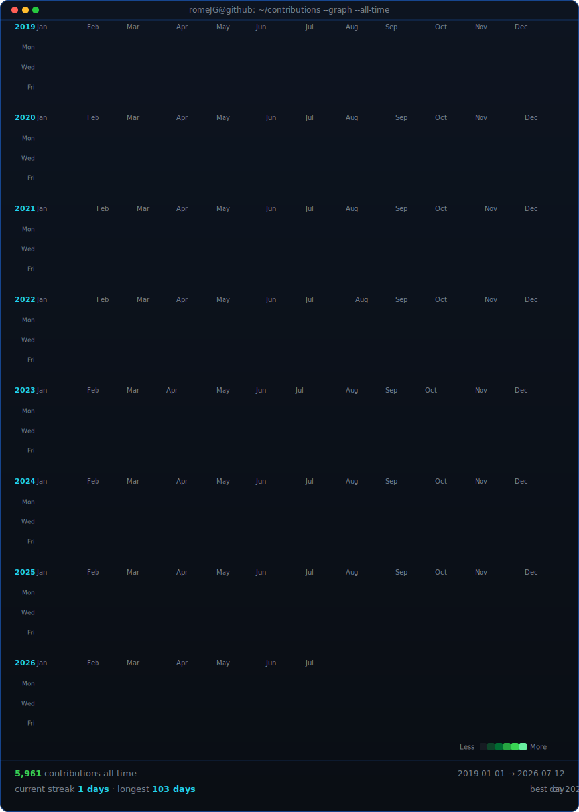

<table>
<tr>
<td valign="top"></td>
<td valign="top"></td>
</tr>
</table>

## Rome Guillermo

**Full-Stack Software Engineer · PHP/Laravel · React**

 

<!-- animated contribution graph, refreshed daily by update-profile-art.yml -->

<!-- breakout game, refreshed daily by blank.yml -->
<picture>
  <source
    media="(prefers-color-scheme: dark)"
    srcset="images/breakout-dark.svg"
  />
  <source
    media="(prefers-color-scheme: light)"
    srcset="images/breakout-light.svg"
  />
  
</picture>

<!-- GitHub Stats -->
<picture>
  <source
    media="(prefers-color-scheme: dark)"
    srcset="https://github-readme-stats-alpha-ten-19.vercel.app/api?username=romeJG&show_icons=true&theme=merko&hide_border=true&count_private=true&include_all_commits=true"
  />
  
</picture>

<!-- Top Languages -->
<picture>
  <source
    media="(prefers-color-scheme: dark)"
    srcset="https://github-readme-stats-alpha-ten-19.vercel.app/api/top-langs/?username=romeJG&layout=compact&theme=merko&hide_border=true&count_private=true&include_all_commits=true"
  />
  
</picture>

<!-- Streak Stats -->
<picture>
  <source
    media="(prefers-color-scheme: dark)"
    srcset="https://streak-stats.vercel.app/?user=romejg&theme=merko&hide_border=true"
  />
  
</picture>

 
 

