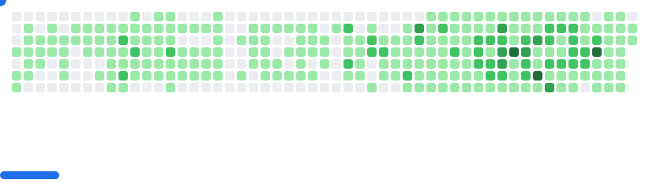

<h1 align="center">Hi 👋🏾, I'm Rome</h1>
<h3 align="center">A Full-Stack Software Engineer</h3> 

-   🔗 Visit my **[website](https://romejg.vercel.app/)**

-   🔭 I’m currently working on **Our Start Up**

-   🌱 I’m currently Learning **IT Infra** and **[AI](https://huggingface.co/)**

-   💬 Ask me about **[PHP](https://php.org), [Laravel](https://laravel.com/), and [React](https://react.dev)**

-   📫 How to reach me **justineguillermo00@gmail.com**

-   ⚡ Fun fact **I try to learn a thing or two everyday**
 

### Stuff I Use:
<table>
  <tr>
    <th>Frontend & Web</th>
    <th>Backend & APIs</th>
    <th>Databases</th>
    <th>DevOps & Infrastructure</th>
    <th>Tools & Workflow</th>
  </tr>

  <tr>
    <td align="center">
      
      
      
      
    </td>
    <td align="center">
      
      
      
      
    </td>
    <td align="center">
      
    </td>
    <td align="center">
      
      
      
      
      
    </td>
    <td align="center">
      
      
      
      
      
    </td>
  </tr>
</table>

<!--

-->
<picture>
  <source
    media="(prefers-color-scheme: dark)"
    srcset="images/breakout-dark.svg"
  />
  <source
    media="(prefers-color-scheme: light)"
    srcset="images/breakout-light.svg"
  />
  
</picture>

  <!-- GitHub Stats -->
  <picture>
    <source
      media="(prefers-color-scheme: dark)"
      srcset="https://github-readme-stats-alpha-ten-19.vercel.app/api?username=romeJG&show_icons=true&theme=merko&hide_border=true&count_private=true&include_all_commits=true"
    />
    
  </picture>

  <!-- Top Languages -->
  <picture>
    <source
      media="(prefers-color-scheme: dark)"
      srcset="https://github-readme-stats-alpha-ten-19.vercel.app/api/top-langs/?username=romeJG&layout=compact&theme=merko&hide_border=true&count_private=true&include_all_commits=true"
    />
    
  </picture>

  <!-- Streak Stats -->
  <picture>
    <source
      media="(prefers-color-scheme: dark)"
      srcset="https://streak-stats.vercel.app/?user=romejg&theme=merko&hide_border=true"
    />
    
  </picture>

      

