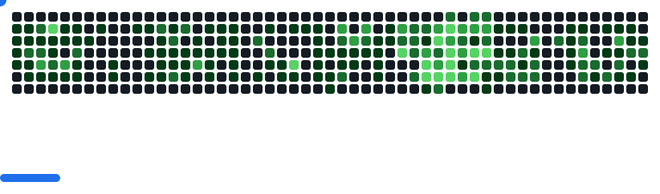

<h1 align="center">Hi 👋🏾, I'm Rome</h1>
<h3 align="center">A Full-Stack Software Engineer.</h3>

-   🔗 Visit my **[website](https://portfolio-romejg.rf.gd)**

-   🔭 I’m currently working on **Updating my portfolio**

-   🌱 I’m currently Reading **[Pro Git](https://git-scm.com/book/en/v2)** and Learning about **[AI](https://huggingface.co/)**

-   💬 Ask me about **[PHP](https://php.org), [Laravel](https://laravel.com/), and [React](https://react.dev)**

-   📫 How to reach me **justineguillermo00@gmail.com**

-   ⚡ Fun fact **I try to learn a thing or two everyday**

<h3 align="left">Connect with me:</h3>

  

<h3 align="left">Languages:</h3>

  
  
  
  <a
    href="https://developer.mozilla.org/en-US/docs/Web/JavaScript"
    target="_blank"
    rel="noreferrer"
  >
  
    
  </a>
  
  
  
  
  
   

<h3 align="left">Tools:</h3>

  

  
  
  
  

<h3 align="left">OS:</h3>

  
   
   
  

<!--

-->

<picture>
  <source
    media="(prefers-color-scheme: dark)"
    srcset="images/breakout-dark.svg"
  />
  <source
    media="(prefers-color-scheme: light)"
    srcset="images/breakout-light.svg"
  />
  
</picture>

  

    
  

  

    
  

  

